# Client Portal Starter

A **secure, accessible, enterprise-grade client portal starter** built with
**Next.js (App Router), TypeScript, Tailwind CSS v4 and shadcn/ui**. It's a
production-quality reference and reusable kit for customer portals — designed
for consulting firms, MSPs, SaaS, legal, healthcare, logistics, finance,
insurance, real estate, education and B2B companies.

> **Status:** client-only **mock** (no backend) so it runs instantly. Every
> decision is made so the mock can be swapped for a real backend with minimal
> churn — see [`docs/architecture.md`](docs/architecture.md).

<p align="center">
  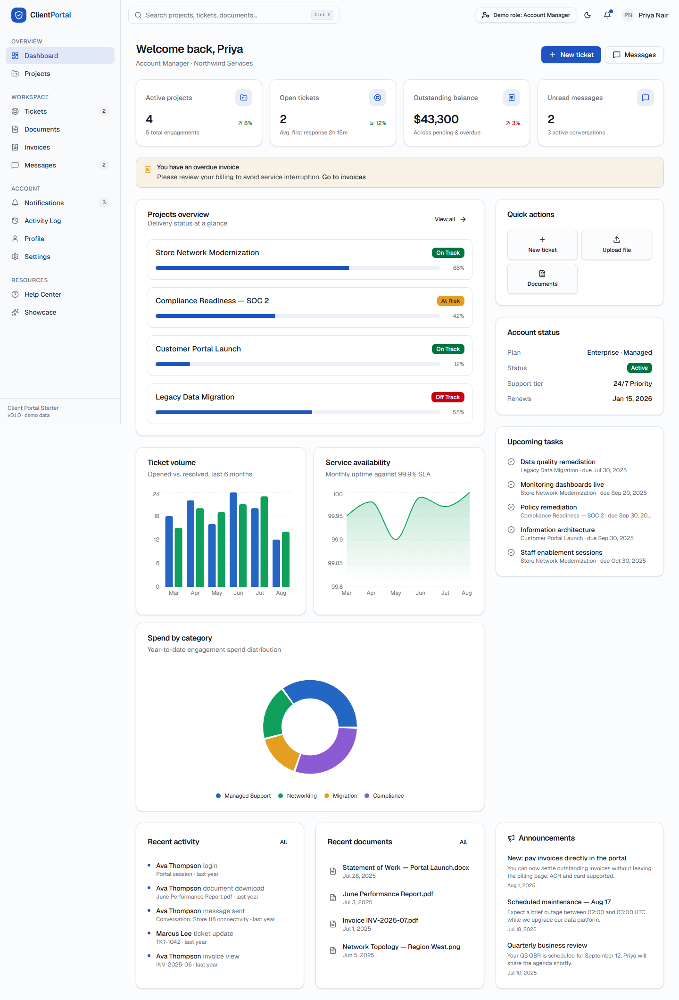
</p>

## Highlights

- **12 modules** — Dashboard, Projects, Tickets, Documents, Invoices, Messages,
  Notifications, Profile, Settings, Help Center, Activity Log, Showcase.
- **Real interactions** — create tickets, reply & change status, send messages,
  pay invoices, download/upload documents, edit profile & settings.
- **Security-first** — central RBAC (4 roles), hardened headers/CSP, shared Zod
  validation, idle timeout, audit trail, no secrets in the client.
- **Accessible** — WCAG AA focus: keyboard nav, skip link, labeled controls,
  dark mode, `prefers-reduced-motion`; verified with axe (Jest + Playwright).
- **Great DX** — strict TypeScript, ESLint + Prettier, Husky + lint-staged,
  Jest + RTL, Playwright, typed env, useful scripts.
- **Command palette** (⌘/Ctrl-K), charts, sortable/filterable tables, toasts.

## Quick start

```bash
npm install
npm run dev          # http://localhost:3000
```

**Demo sign-in** (mock auth, password `demo1234`) — or use the one-click demo
buttons on the login page, and the header **"Demo role"** switcher to see RBAC
change the UI live:

| Role            | Email                     |
| --------------- | ------------------------- |
| Client          | client@acme.example       |
| Support Agent   | agent@northwind.example   |
| Account Manager | manager@northwind.example |
| Administrator   | admin@northwind.example   |

## Screenshots

| Login                                | Dashboard (dark)                                       |
| ------------------------------------ | ------------------------------------------------------ |
| 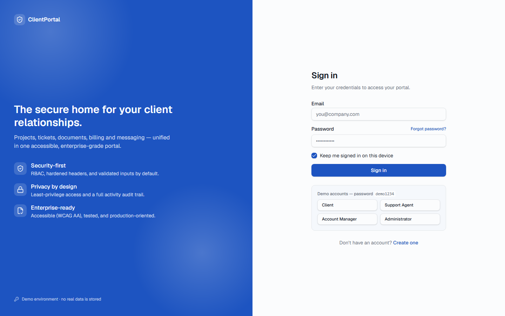 | 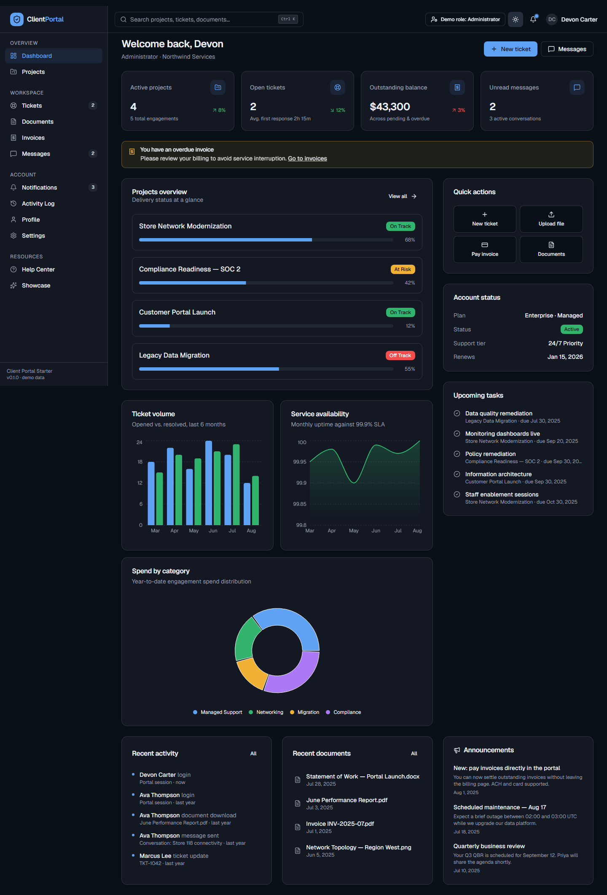 |

| Projects                                   | Project detail                                         |
| ------------------------------------------ | ------------------------------------------------------ |
| 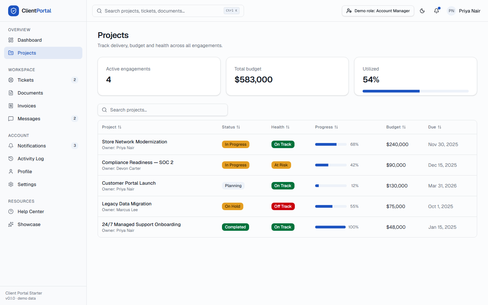 | 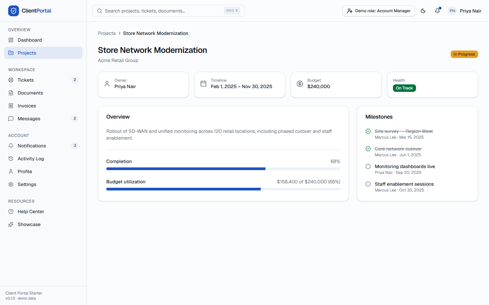 |

| Tickets                                  | Ticket detail                                        |
| ---------------------------------------- | ---------------------------------------------------- |
| 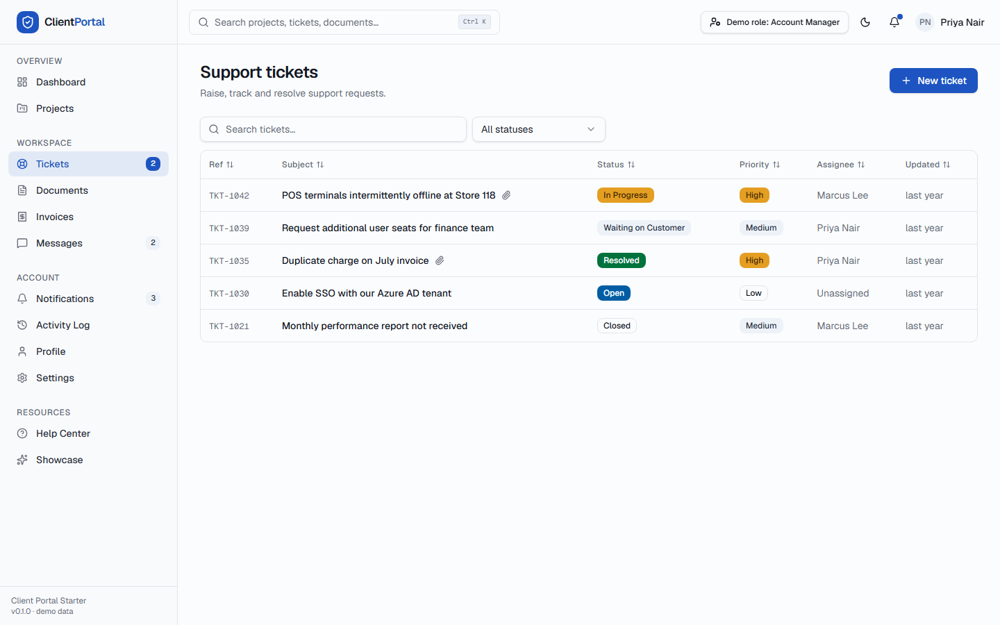 | 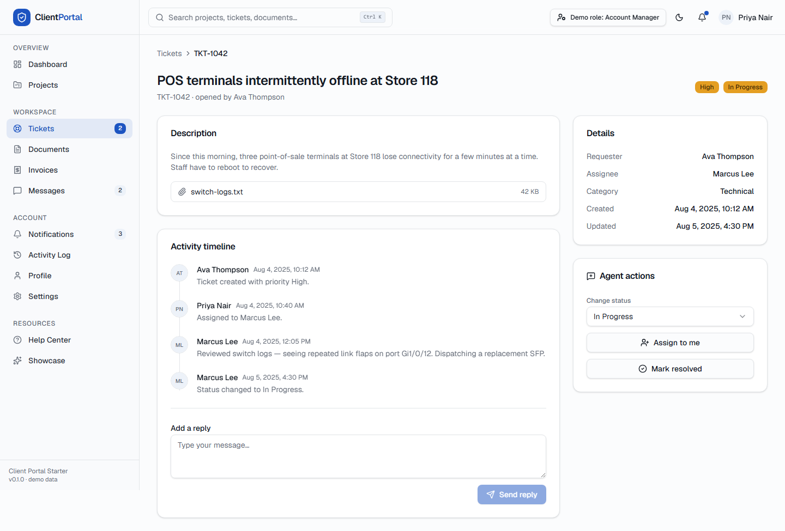 |

| Documents                                    | Invoices                                   |
| -------------------------------------------- | ------------------------------------------ |
| 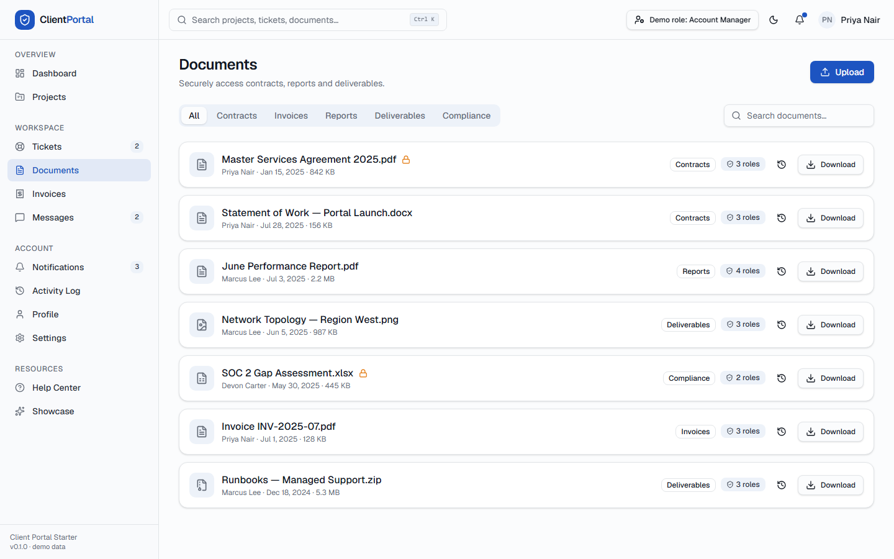 | 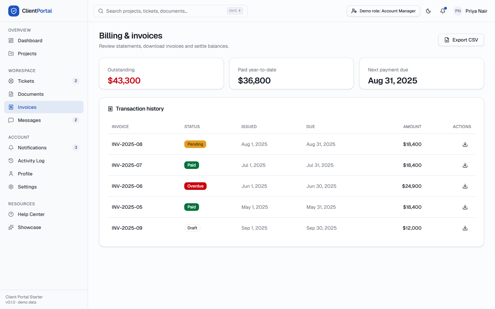 |

| Messages                                   | Activity log                                       |
| ------------------------------------------ | -------------------------------------------------- |
| 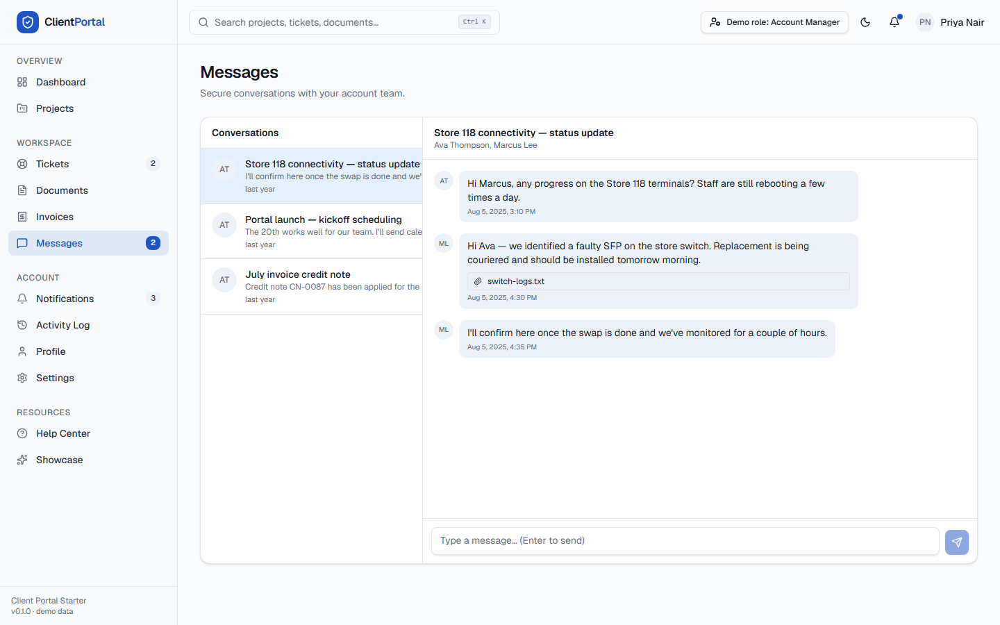 | 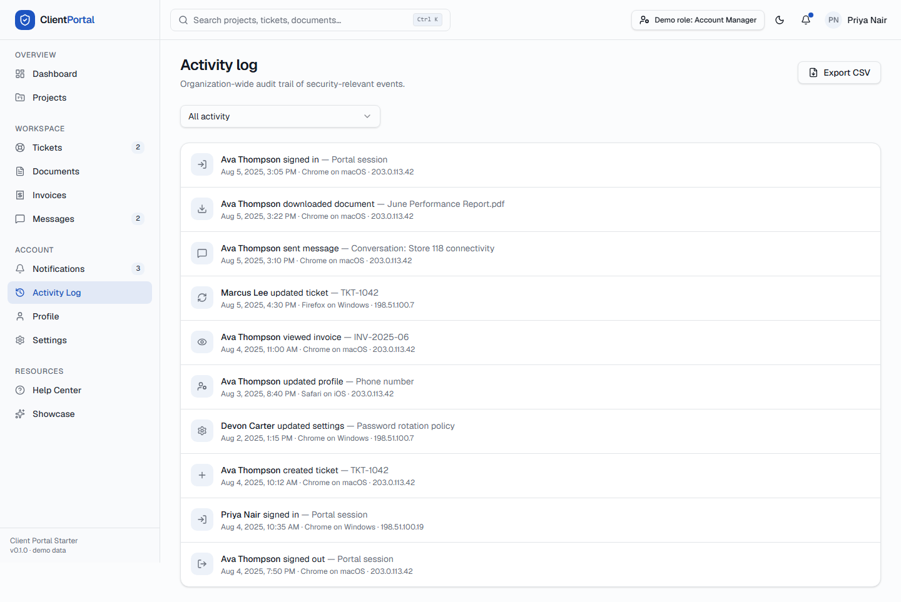 |

| Settings                                   | Showcase (industry adaptations)            |
| ------------------------------------------ | ------------------------------------------ |
| 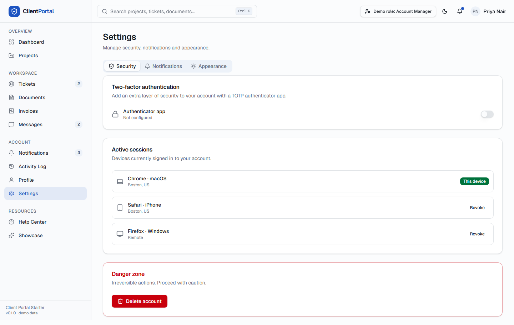 | 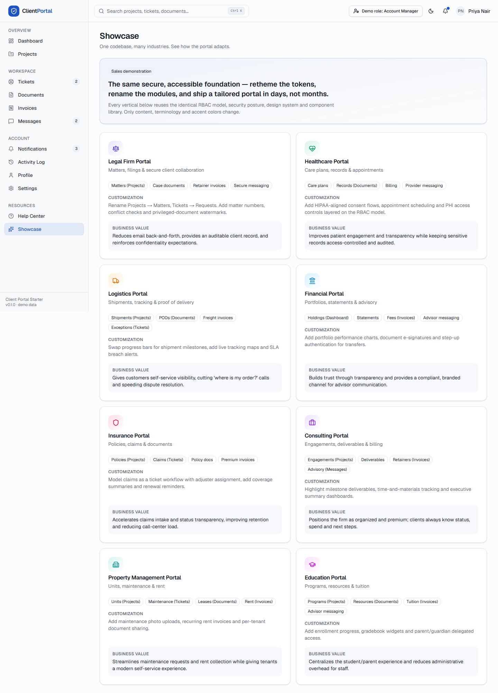 |

> Regenerate anytime with `npm run screenshots` (Playwright).

## Tech stack

| Area         | Choice                                             |
| ------------ | -------------------------------------------------- |
| Framework    | Next.js 16 (App Router) + React 19                 |
| Language     | TypeScript (strict)                                |
| Styling      | Tailwind CSS v4 + shadcn/ui (Radix) + OKLCH tokens |
| State        | Zustand                                            |
| Data (ready) | TanStack Query                                     |
| Tables       | TanStack Table                                     |
| Charts       | Recharts                                           |
| Validation   | Zod + React Hook Form                              |
| Testing      | Jest, React Testing Library, Playwright, axe       |
| Quality      | ESLint, Prettier, Husky, lint-staged               |

## Scripts

```bash
npm run dev         # dev server            npm test           # unit + a11y
npm run build       # production build       npm run coverage   # coverage
npm run start       # serve prod build       npm run e2e        # Playwright + axe
npm run typecheck   # tsc --noEmit           npm run screenshots# capture images
npm run lint        # eslint                 npm run audit      # npm audit (prod)
npm run format      # prettier --write
```

## Project structure

```
src/
├─ app/(auth)         # login / register / forgot-password
├─ app/(portal)       # guarded shell + all module pages
├─ components/ui      # shadcn-style primitives (Radix)
├─ components/portal  # shell: sidebar, topbar, guard, command palette, idle-timeout
├─ components/shared  # page header, data table, breadcrumbs, empty/loading states
├─ components/rbac    # <Can> permission gate
├─ lib                # rbac, types, validations, format, navigation, mock data
└─ stores             # zustand stores (auth, tickets, invoices, docs, messages…)
```

## Documentation

| Doc                                                                                                         | What                                               |
| ----------------------------------------------------------------------------------------------------------- | -------------------------------------------------- |
| [discovery.md](docs/discovery.md)                                                                           | Vision, personas, roadmap                          |
| [architecture.md](docs/architecture.md)                                                                     | Structure & decisions                              |
| [rbac.md](docs/rbac.md)                                                                                     | Roles & permission matrix                          |
| [security-implementation.md](docs/security-implementation.md)                                               | Controls & production design                       |
| [security-model.md](docs/security-model.md)                                                                 | Threat model                                       |
| [security-governance.md](docs/security-governance.md)                                                       | Dependency review                                  |
| [security-audit.md](docs/security-audit.md)                                                                 | Findings & severity                                |
| [design-system.md](docs/design-system.md)                                                                   | Tokens & components                                |
| [design-research.md](docs/design-research.md)                                                               | Sources & licenses                                 |
| [accessibility.md](docs/accessibility.md)                                                                   | WCAG AA approach                                   |
| [testing.md](docs/testing.md)                                                                               | Test strategy                                      |
| [observability.md](docs/observability.md)                                                                   | Logging/monitoring/tracing                         |
| [ai-readiness.md](docs/ai-readiness.md)                                                                     | Path to AI features                                |
| [setup.md](docs/setup.md) · [deployment.md](docs/deployment.md) · [customization.md](docs/customization.md) | Ops & white-labelling                              |
| [business-use-cases.md](docs/business-use-cases.md) · [future-roadmap.md](docs/future-roadmap.md)           | Product                                            |
| [**improvements.md**](docs/improvements.md)                                                                 | **User-first improvement report (incl. security)** |
| [final-audit.md](docs/final-audit.md)                                                                       | Quality gate & grades                              |

## Production checklist (before going live)

This starter is intentionally client-only. Before production, implement the
documented server-side controls: real auth (httpOnly cookies + SSO/MFA),
server-enforced RBAC, persistence, secure file pipeline, payments, CSRF, rate
limiting and a nonce-based CSP. See [deployment.md](docs/deployment.md) and
[security-audit.md](docs/security-audit.md).

## License

[MIT](LICENSE)
